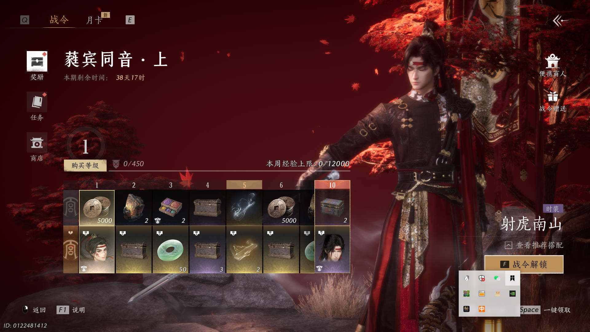

好的，那你在玩的时候，可以关注一下燕云的红点系统
1）首先可以根据游戏中的体验，尝试分析一下策划这边的需求
2）根据分析的结果，尝试自己设计一个红点框架（tips：可以从易于使用、性能等角度


# 燕云十六声红点系统解析

## 策划需求

### 系统概述

在游戏中，红点通常用于提示玩家有新的任务、奖励或其他未读消息等等。

由于红点系统本身有一定复杂性，且需要使用的地方很多，所以一般会选择将红点系统提取出来，单独成为一套系统。


### 细节

在实际游戏中，红点系统通常以树的形式来规划，以燕云十六声为例：

以下是几张燕云十六声实际游玩时候的截图

**主界面**


**邮件子界面**

<center class="half">
    
    
</center>


**活动子界面**

<center class="half">
    
    
    
</center>


**战令子界面**

<center class="half">
    
    
    
</center>


#### 树形结构

以树状图归纳一下截图中展现出来的红点系统


#### 表现形式

燕云中的红点有多种表现形式，以 [邮件系统] 和 [活动系统] 为例


**邮件系统**

1. root界面，邮件图标右上角显示一个角标，显示所有待处理的邮件的数量
2. 邮件界面内，每个待处理邮件会显示一个普通的红点

<center class="half">
    
    
</center>


**活动系统**

1. root界面，活动右上角显示一个普通红点，展示是否有未交互的活动
2. 活动界面内，一级界面，图标右上角显示一个普通红点，展示是否有未交互的活动
3. 活动界面内，二级界面，图标右上角显示一个普通红点，该活动是否已经交互

<center class="half">
    
    
</center>


#### 交互形式

为了便于用户操作，红点的改变可以被多种形式触发，以 [邮件系统] 和 [战令系统] 为例


**邮件系统**

1. 鼠标单击未邮件，消除点击邮件上的红点
2. 鼠标单击全部领取，消除所有未读邮件上的红点


**战令系统**

1. 鼠标单击未领取奖励，消除点击奖励上的红点
2. 鼠标单击一键领取，消除所有未领取奖励上的红点	


## 技术设计

### 思路

1. 红点系统整体成树形结构，且叶子结点的变更会影响非叶子节点，所以整体数据结构采用 [前缀树]
2. 为了实现表现层和逻辑层解耦，把红点系统分为数据层和表现层，通过回调函数的方式实现数据表现同步
3. 为了实现红点系统和其他业务逻辑解耦，应有单独的 Manager 类


### 细节

以下是在 Unity 中实现的简单 Demo

仅粗略展示，具体代码在 --> https://github.com/aolixin/RedDotSystem，测试场景在 ReddotScene


#### **数据层**

**RedDotNode 节点**

```
// RedDotNode.cs
// 数据层维护节点名称，红点数量，父节点，节点数量变更回调函数，子节点等信息
// 子节点通过哈希表存储，键是节点名称

namespace RedDotSys
{
    public class RedDotNode
    {
        public string rdName { get; set; }
        public int rdCount { get; private set; }
        public RedDotNode parent;
        public RedDotSystem.OnRdCountChange countChangeFunc;
        public Dictionary<string, RedDotNode> rdChildrenDic = new Dictionary<string, RedDotNode>();
        private void CheckRedDotCount()
        private void NotifyRedDotCountChange()
        public void SetRedDotCount(int rdCount)
    }
}
```


**红点树**

```
// 红点树的相关操作

namespace RedDotSys
{
    public static class E_RedDotDefine
    {
        public const string rdRoot = "Root";
        public const string MailBox = "Root/Mail";
        public const string MailBox_System = "Root/Mail/System";
        public const string MailBox_Team = "Root/Mail/Team";
    }


    public class RedDotSystem
    {
        public RedDotSystem()
        public delegate void OnRdCountChange(RedDotNode node);
        private RedDotNode mRootNode;
        private static List<string> lstRedDotTreeList = new List<string>;

		// 初始化红点树
        private void InitRedDotTreeNode()
        // 设置节点回调函数
        public void SetRedDotNodeCallBack(string strNode, OnRdCountChange callBack)
        // 添加新节点
        public void Add(string nodePath, OnRdCountChange callBack, int rdCount)
        // 设置节点红点数量
        public void Set(string nodePath, int rdCount)
        // 获取节点红点数量
        public int GetRedDotCount(string nodePath)
    }
}
```


#### 表现层

需要展示红点的 UI 组件，统一接口

```
// 继承 IRedDotItem，实现具体的红点展示逻辑
namespace RedDotSys
{
    public interface IRedDotItem
    {
        public void SetDotState(bool isShow, int dotCount = -1);
    }
}
```


带有数字的红点 UI 组件实现

```
// 带有数字的红点 UI 组件实现
namespace RedDotSys
{
    public class NumberRedDotItem : MonoBehaviour, IRedDotItem
    {
        [SerializeField] public GameObject m_DotObj;
        [SerializeField] private TextMeshProUGUI m_DotCountText;

        public void SetDotState(bool isShow, int dotCount)
        {
            if (isShow)
            {
                m_DotObj.gameObject.SetActive(true);
                m_DotCountText.gameObject.SetActive(true);
                if (m_DotCountText)
                    m_DotCountText.SetText(dotCount >= 0 ? dotCount.ToString() : "");
            }
            else
            {
                m_DotObj.gameObject.SetActive(false);
                m_DotCountText.gameObject.SetActive(false);
                m_DotCountText.SetText("");
            }
        }
        private void OnDestroy()
    }
}
```


UI 表现层中使用

主要是初始化红点树，为节点添加表现层的回调函数

一些测试用的事件函数

```

namespace RedDotSys
{
    public class UI_Email : MonoBehaviour
    {
        public NumberRedDotItem MailDot;
        public NumberRedDotItem MailSystemDot;
        public NormalRedDotItem MailTeamDot;
        public Dictionary<string, EmailRedDotItem> id_emailItemDic = new Dictionary<string, EmailRedDotItem>();
        public GameObject EmailPrefab;
        public GameObject MailSystemContent;
        public GameObject MailTeamContent;


        void Start()
        {
            ManagerComponent.RedDotManager.SetRedDotNodeCallBack(E_RedDotDefine.MailBox, MailCallBack);
            ManagerComponent.RedDotManager.SetRedDotNodeCallBack(E_RedDotDefine.MailBox_System, MailSystemCallBack);

            ManagerComponent.RedDotManager.Set(E_RedDotDefine.MailBox_System, 0);
            ManagerComponent.RedDotManager.Set(E_RedDotDefine.MailBox_Team, 0);
        }

        private void OnDestroy()

        void MailCallBack(RedDotNode node)
        {
            MailDot.SetDotState(node.rdCount > 0, node.rdCount);
        }

        void MailSystemCallBack(RedDotNode node)
        {
            MailSystemDot.SetDotState(node.rdCount > 0, node.rdCount);
        }

        void MailTeamCallBack(RedDotNode node)
        {
            MailTeamDot.SetDotState(node.rdCount > 0, node.rdCount);
        }

        void SystemEmailCallBack(RedDotNode node)
        {
            if (node.rdCount > 0)
            {
                var go = Instantiate(EmailPrefab, MailSystemContent.transform);
                EmailRedDotItem emailItem = go.GetComponent<EmailRedDotItem>();
                emailItem.Init(node, OnReduceRdSystemBtnClick);
                emailItem.SetDotState(true, node.rdCount);

                id_emailItemDic.Add(node.rdName, emailItem);
            }
            else
            {
                if (id_emailItemDic.TryGetValue(node.rdName, out EmailRedDotItem emailItem))
                {
                    emailItem.SetDotState(false);
                }
            }
        }

        void TeamEmailCallBack(RedDotNode node)
        {
            if (node.rdCount > 0)
            {
                var go = Instantiate(EmailPrefab, MailTeamContent.transform);
                EmailRedDotItem emailItem = go.GetComponent<EmailRedDotItem>();
                emailItem.Init(node, OnReduceRdTeamBtnClick);
                emailItem.SetDotState(true, node.rdCount);

                id_emailItemDic.Add(node.rdName, emailItem);
            }
            else
            {
                if (id_emailItemDic.TryGetValue(node.rdName, out EmailRedDotItem emailItem))
                {
                    emailItem.SetDotState(false);
                }
            }
        }


        #region GM

        static int _emailId = 0;

        private int GenEmailID()
        {
            return _emailId++;
        }

        public void OnAddRdSystemBtnClick(Transform EmailParent)
        {
            var path = E_RedDotDefine.MailBox_System + "/" + GenEmailID();
            ManagerComponent.RedDotManager.Add(path, SystemEmailCallBack, 1);
        }

        public void OnAddRdTeamBtnClick(Transform EmailParent)
        {
            var path = E_RedDotDefine.MailBox_Team + "/" + GenEmailID();
            ManagerComponent.RedDotManager.Add(path, TeamEmailCallBack, 1);
        }

        public void OnReduceRdSystemBtnClick(RedDotNode node)
        {
            var path = E_RedDotDefine.MailBox_System + "/" + node.rdName;
            ManagerComponent.RedDotManager.Set(path, 0);
        }

        public void OnReduceRdTeamBtnClick(RedDotNode node)
        {
            var path = E_RedDotDefine.MailBox_Team + "/" + node.rdName;
            ManagerComponent.RedDotManager.Set(path, 0);
        }

        #endregion
    }
}
```


### Demo 视频

